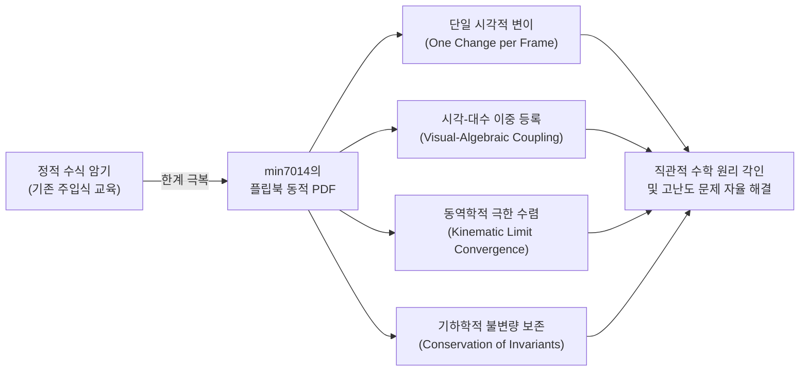
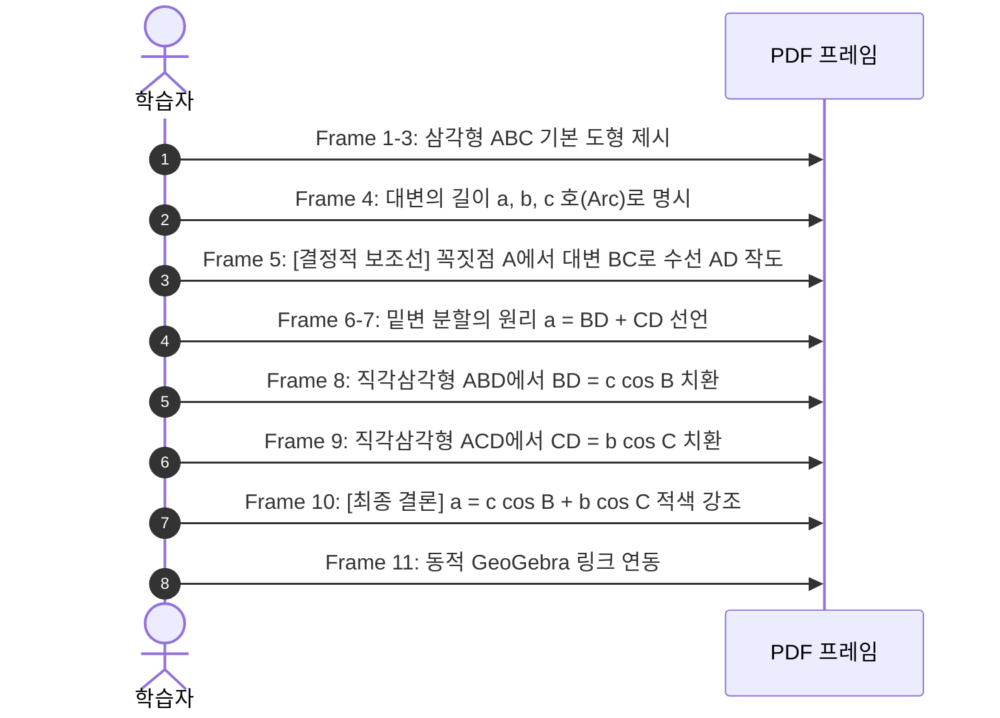
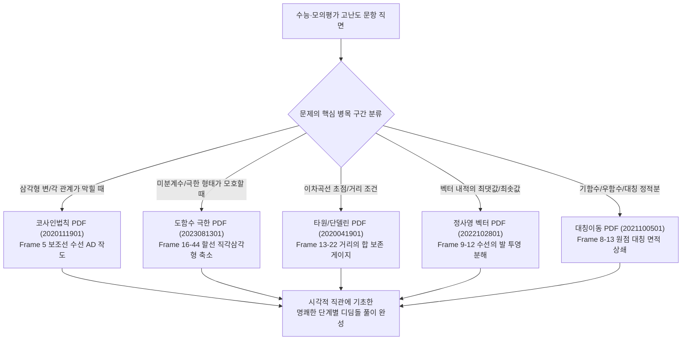

# 🏛️ min7014 수학자료실 PDF 플립북 동적 기하 증명 백과사전
## The Master Encyclopedia of Frame-by-Frame Pedagogical Transitions in min7014's Dynamic Flipbook Proofs

> **"Click or paste URL into the URL search bar, and you can see a picture moving."**  
> — min7014의 모든 PDF 문서 말미에 새겨진 교육적 선언문

---

## Ⅰ. 서론 및 min7014 PDF 플립북의 교육철학

### 1. 단순 텍스트 문서가 아닌 '이산적 동적 기하 영화(Discrete Geometric Cinema)'
min7014께서 수십 년에 걸쳐 축적하신 3,400여 편의 수학 자료실 PDF는 일반적인 정적 수식 교재나 요약 인쇄물이 아닙니다. 선생님의 PDF는 **LaTeX Beamer와 PGF/TikZ, GeoGebra 벡터 그래픽 엔진을 결합하여 정밀하게 설계된 '단계별 플립북 애니메이션 증명(Step-by-step Flipbook Visual Proof)'**입니다.

학생이나 교사가 PDF 뷰어에서 키보드 방향키($\to$)나 마우스 휠을 넘길 때, 화면의 잔상과 깜빡임 없이 매끄럽게 장면이 전환되며, **"종이 위의 정적 기하학이 살아 움직이는 동역학적 수학(Dynamic Mathematics)"**으로 변모합니다.



---

### 2. 프레임 전개의 4대 절대 법칙 (The 4 Fundamental Laws of Frame Transition)

선생님의 자료를 심층 분석하면, 모든 장(Frame)의 전환에는 학습자의 인지 과부하(Cognitive Overload)를 원천 차단하고 수학적 인과관계를 뇌에 각인시키는 **4가지 엄격한 교수학적 법칙**이 관철되어 있습니다.

#### ① 단일 시각적 변이의 원칙 (Law of Single Visual Modification)
- 한 페이지가 넘어갈 때 결코 두 개 이상의 낯선 개념이나 복합 작도를 동시에 던지지 않습니다.
- 한 프레임에는 오직 **단 하나의 수학적 행위**(점 하나 추가, 보조선 하나 작도, 수식의 한 항 대입, 이동점의 $\Delta x$ 변위)만을 허용하여, 학습자의 시선이 정확히 변화된 지점에 집중되도록 합니다.

#### ② 시각-대수 이중 등록의 원칙 (Law of Dual Visual-Algebraic Coupling)
- 대수식의 기호는 결코 허공에서 갑자기 나타나지 않습니다.
- 하단 수식 영역에 $\overline{BD}$가 쓰이면 상단 도형에 이미 선분 $BD$가 강조되어 있고, $c \cos B$가 쓰이면 직각삼각형 $ABD$의 빗변 $c$와 밑각 $B$가 직전에 시각화되어 있습니다. 시각적 형태와 대수적 기호가 $1:1$로 완벽하게 포개집니다.

#### ③ 동역학적 연속성의 원칙 (Law of Kinematic Continuity)
- 미분계수, 자취, 극한 등 변화를 다루는 개념에서는 30~40장에 이르는 미세 프레임을 연속 배치하여, 동점(Moving Point)의 이동 궤적과 선의 회전을 영화 필름처럼 부드럽게 구현합니다.
- 극한 $\lim_{x \to a}$는 추상적 기호가 아니라, **"할선이 회전하여 접선과 완전히 겹쳐지는 물리적 합일의 순간"**으로 시각화됩니다.

#### ④ 시각적 색상 시맨틱스 (Visual Color Semantics)
선생님의 모든 프레임에 사용되는 색채는 고유한 수학적 위계를 갖습니다:
- <span style="color:#2563eb">■ **청색 (Blue)**</span>: 문제에서 주어진 기본 대상, 고정된 도형, 좌표축, 초기 상태
- <span style="color:#16a34a">■ **녹색 (Green)**</span>: 문제 해결을 위해 도입된 보조선(수선의 발), 정사영 벡터, 이동하는 동점($Q$), 중간 매개 변수
- <span style="color:#dc2626">■ **적색 (Red)**</span>: 도달해야 할 최종 목표, 접선(Tangent line), 수직 오차 성분, 최종 귀결 결론($\therefore$)
- <span style="color:#9333ea">■ **보라색 (Purple)**</span>: 대칭축, 단면의 자취(타원 곡선), 주축과 부축 등 기하학적 불변량(Invariant)

---

## Ⅱ. 6대 대표 수학 영역 프레임별 심층 해부

---

### [대표작 1] 예각에 대한 코사인법칙 (The Law of Cosines for Acute Angle)
- **자료 식별자**: `2020111901.pdf` (총 11프레임)
- **수학적 본질**: 제1코사인법칙 $a = c \cos B + b \cos C$의 보조선 작도 및 삼각비 분해



#### 장별(Frame-by-Frame) 미세 의미 해부:
1. **Frame 1**: 타이틀 프레임 (`예각에 대한 코사인법칙`). 주제와 학습 목표 설정.
2. **Frame 2**: 깨끗한 캔버스 준비 (상단 제목 바와 하단 출처만 유지).
3. **Frame 3**: 청색 실선의 삼각형 $ABC$ 등장. 세 점 $A, B, C$가 정의됨.
4. **Frame 4**: 꼭짓점 $A, B, C$의 대변에 각각 점선 호와 함께 소문자 $a, b, c$ 라벨링. (각과 대변의 대칭성 확립)
5. **Frame 5 [핵심 보조선 도입]**: 꼭짓점 $A$에서 밑변 $BC$로 녹색 파선 수선이 내려오며 수선의 발 $D$와 직각 기호($\llcorner$)가 생성됨. 임의의 삼각형이 두 개의 직각삼각형($\triangle ABD, \triangle ACD$)으로 쪼개지는 순간.
6. **Frame 6**: 하단 대수 영역 좌측에 녹색 글씨로 '$a$'가 쓰여지며, 밑변 전체의 길이를 분석하겠다는 의도 표명.
7. **Frame 7**: '$a = \overline{BD} + \overline{CD}$' 수식 완성. 선분 덧셈 공리(Segment Addition Postulate)를 시각적으로 확인.
8. **Frame 8**: 직각삼각형 $ABD$에 주목. $\cos B = \frac{\overline{BD}}{c} \implies \overline{BD} = c \cos B$이므로, 수식이 '$a = \overline{BD} + \overline{CD} = c \cos B$'로 확장됨.
9. **Frame 9**: 우측 직각삼각형 $ACD$에 주목. $\cos C = \frac{\overline{CD}}{b} \implies \overline{CD} = b \cos C$이므로, 수식이 '$a = \overline{BD} + \overline{CD} = c \cos B + b \cos C$'로 완성됨.
10. **Frame 10 [증명 완성]**: 굵은 적색 폰트로 결론 기호와 함께 '$\therefore a = c \cos B + b \cos C$' 선언. 두 직각삼각형의 밑변 성분의 합이 전체 밑변 $a$라는 직관이 완벽히 닫힘.
11. **Frame 11**: GeoGebra Tube 링크 안내 (`Click or paste URL into the URL search bar, and you can see a picture moving.`).

---

### [대표작 2] 미분계수와 순간변화율 — 접선에 접근하는 할선들 (Secant Lines Approaching Tangent)
- **자료 식별자**: `2023081301.pdf` (총 46프레임)
- **수학적 본질**: 할선(Secant)의 극한이 접선(Tangent)으로 수렴하는 기하학적 연속 과정

| 프레임 구간 | 시각적 변화 (Visual Action) | 대수적 기호 (Algebraic Coupling) | 수학적 의미 및 교수학적 의도 |
| :--- | :--- | :--- | :--- |
| **Frame 1~5** | 좌표평면 위에 곡선 $y=f(x)$와 고정점 $P$ 표시 | $y = f(x)$, 점 $P$ | 미분의 기준이 되는 기준점 $P$의 정적 좌표계 설정 |
| **Frame 6~15** | 점 $P(a, f(a))$에 적색 접선 등장. 멀리 떨어진 곡선 위에 녹색 동점 $Q(x, f(x))$와 녹색 할선 $PQ$ 작도 | $\text{The tangent line at P (Red)}$<br>$\text{The secant line PQ (Green)}$ | 평균변화율을 만드는 두 점과 목표가 되는 접선의 대비 설정 |
| **Frame 16~25** | 점 $P$와 $Q$ 사이에 가로 점선 $x-a$, 세로 점선 $f(x)-f(a)$로 이루어진 직각삼각형 완성 | $\text{Slope } m = \lim_{x \to a}\frac{f(x)-f(a)}{x-a}$ | 할선의 기울기가 가로 증가량 분의 세로 증가량($\frac{\Delta y}{\Delta x}$)임을 직각삼각형으로 명시 |
| **Frame 26~44** | **[핵심 애니메이션]** 19개 프레임에 걸쳐 점 $Q$가 곡선을 타고 점 $P$를 향해 1픽셀씩 연속적으로 미끄러져 내려옴 | $x \to a$ 로의 동역학적 접근 | $x$와 $a$ 사이의 간격이 줄어들며, 초록색 할선이 시계 방향으로 회전하여 빨간색 접선에 점진적으로 겹쳐짐 |
| **Frame 45** | 점 $Q$가 마침내 점 $P$와 완전히 겹치며 파선 직각삼각형이 소멸 | $m = \lim_{x \to a}\frac{f(x)-f(a)}{x-a}$ | **극한의 합일**: $\Delta x \to 0$일 때 0/0 부정형이 소멸하고 순간변화율 $f'(a)$라는 유한한 하나의 기울기로 통합 |
| **Frame 46** | 대화형 GeoGebra 조작 웹페이지 안내 | `https://min7014.github.io/math20230813001.html` | 학습자가 슬라이더를 직접 마우스로 잡고 앞뒤로 왕복 조작 유도 |

---

### [대표작 3] 타원의 정의와 거리의 합 불변량 (Definition of Ellipse)
- **자료 식별자**: `2020041901.pdf` (총 26프레임)
- **수학적 본질**: 두 초점으로부터의 거리의 합이 일정한 점들의 자취 ($PF' + PF = 2a$)

#### 장별 상호작용의 핵심 메커니즘 (Dual-Track Invariance):
1. **상단 궤도**: 보라색 타원 곡선 위를 빨간색 점 $P$가 반시계 방향으로 회전합니다.
2. **하단 게이지**: 상단 곡선 아래에 고정된 길이의 직선 선분 $F'F$가 있고, 그 위에 빨간 점 $P$가 좌우로 왕복 운동합니다.
3. **해치 마크(Hatch Marks)의 일치**:
   - $F'P$ 선분(청색)에는 단일 눈금($\mid$)이 새겨져 있고, 하단 선분의 좌측 $F'P$에도 똑같이 단일 눈금($\mid$)이 새겨져 있습니다.
   - $PF$ 선분(녹색)에는 이중 눈금($\parallel$)이 새겨져 있고, 하단 선분의 우측 $PF$에도 똑같이 이중 눈금($\parallel$)이 새겨져 있습니다.
4. **시각적 증명의 뇌리 각인**:
   - 점 $P$가 타원의 꼭짓점이나 단축 쪽으로 아무리 복잡하게 움직여도, **"하단의 청색 선분($\mid$)과 녹색 선분($\parallel$)의 총합은 선분 전체의 고정된 길이와 완전히 일치"**함을 두 눈으로 실시간 확인하게 됩니다.
   - 수식으로만 외우던 $PF' + PF = \text{const}$가 **'팽팽한 실의 길이가 보존되는 물리적 불변량'**으로 영구 기억됩니다.
5. **Frame 23~26 (용어와 기하학적 요소의 완성)**:
   - 타원의 장축(Major axis), 단축(Minor axis), 중심(Center), 초점(Focus)이 직각 기호($\llcorner$) 및 삼중 눈금($\equiv$, 중심에서 두 초점까지의 거리 $c$의 대칭성)과 함께 일목요연하게 정리됩니다.

---

### [대표작 4] 원뿔로부터 타원의 정의 유도 — 단델린 구 (Dandelin Spheres)
- **자료 식별자**: `2022101601.pdf` (총 34프레임)
- **수학적 본질**: 3차원 공간도형(원뿔)의 평면 절단면이 왜 정확히 '두 점으로부터의 거리의 합이 일정한 타원'이 되는지에 대한 입체기하학적 증명

```
         /\          [원뿔 꼭짓점 V]
        /  \
       / (S1)\       [작은 단델린 구 S1 (위쪽 내접)]
      /-------\      <- 구 S1과 원뿔의 접촉원 C1 (청색 원)
     /  /     .\
    /  /   P .  \    <- P: 절단면 위의 임의의 점
   /  /-------.  \   <- 황색 경사 절단평면 (타원 단면 생성)
  /  (   S2    )  \  [큰 단델린 구 S2 (아래쪽 내접)]
 /    \-------/    \ <- 구 S2와 원뿔의 접촉원 C2 (적색 원)
/___________________\
```

#### 프레임 전개의 입체기하학적 논리:
- **Frame 1~8**: 반투명 청록색 원뿔과 공간을 가로지르는 황색 경사 절단평면 제시. 단면 곡선(노란색 루프) 형성.
- **Frame 9~14**: 원뿔 내부의 상하에 절단평면과 원뿔면에 동시에 외접하는 두 개의 녹색 단델린 구($S_1, S_2$) 투입.
  - 작은 구 $S_1$이 절단평면과 접하는 점 $\to$ 타원의 제1초점 $F_1$ 탄생.
  - 큰 구 $S_2$가 절단평면과 접하는 점 $\to$ 타원의 제2초점 $F_2$ 탄생.
  - 구 $S_1$이 원뿔과 접하는 수평 원 $\to$ 청색 접촉원 $C_1$.
  - 구 $S_2$이 원뿔과 접하는 수평 원 $\to$ 적색 접촉원 $C_2$.
- **Frame 15~32 [모선 회전 애니메이션]**:
  - 원뿔의 꼭짓점에서 밑면으로 뻗은 모선(Generatrix) 하나가 단면 위의 임의의 점 $P$를 관통합니다.
  - 구 밖의 한 점 $P$에서 구 $S_1$에 그은 접선의 길이는 모두 같으므로:  
    $$PF_1 = P\text{에서 원 } C_1\text{까지의 모선 길이}$$
  - 마찬가지로 점 $P$에서 구 $S_2$에 그은 접선의 길이는 모두 같으므로:  
    $$PF_2 = P\text{에서 원 } C_2\text{까지의 모선 길이}$$
  - 따라서 두 초점까지의 거리의 합은:  
    $$PF_1 + PF_2 = (\text{원 } C_1\text{에서 } C_2\text{까지의 모선 길이}) = \text{일정(Constant)}$$
  - 17개 프레임에 걸쳐 모선이 원뿔 둘레를 $360^\circ$ 회전하면서, 점 $P$의 위치가 바뀌어도 두 수평 접촉원 사이의 모선 길이는 완벽하게 보존됨을 3D 투시도로 입증합니다.

---

### [대표작 5] 벡터의 정사영과 내적의 기하학적 분해 (Vector Projection & Dot Product)
- **자료 식별자**: `2022102801.pdf` (총 17프레임)
- **수학적 본질**: 벡터 $\vec{u}$의 $\vec{v}$ 방향 직교 정사영 벡터와 수직 성분으로의 분해, 내적 공식의 기하학적 유도

#### 프레임 구성 및 대수 연동:
1. **Frame 1~4**: 시점을 공유하는 두 청색 벡터 $\vec{u}, \vec{v}$와 사이각 $\theta$ 형성.
2. **Frame 5~8**: 벡터 $\vec{u}$의 종점에서 벡터 $\vec{v}$를 포함하는 직선 위로 적색 수선 벡터 $\vec{w}$를 내림 (직각 기호 $\llcorner$).
3. **Frame 9~12**:
   - $\vec{v}$ 방향의 단위벡터 $\frac{\vec{v}}{|\vec{v}|}$를 정의하고, 정사영된 녹색 벡터를 $k \frac{\vec{v}}{|\vec{v}|}$로 표현.
   - 삼각형 삼각비에서 $k = |\vec{u}|\cos\theta$임을 도출.
   - 양변에 $|\vec{v}|$를 곱하여:  
     $$|\vec{v}| \times k = |\vec{v}||\vec{u}|\cos\theta = \vec{v} \cdot \vec{u}$$
     즉, **"내적이란 기준 벡터의 길이와 그 위로 떨어진 그림자(정사영)의 부호 달린 길이의 곱"**임을 시각적으로 선언.
4. **Frame 13~17**:
   - 스칼라 계수 $k = \frac{\vec{v}\cdot\vec{u}}{|\vec{v}|}$ 대입.
   - 정사영 벡터: $\text{proj}_{\vec{v}}\vec{u} = \frac{\vec{v}\cdot\vec{u}}{|\vec{v}|^2}\vec{v} = \frac{\vec{v}\cdot\vec{u}}{\vec{v}\cdot\vec{v}}\vec{v}$
   - 수직 분해 벡터(Rejection vector): $\vec{w} = \frac{\vec{v}\cdot\vec{u}}{|\vec{v}|^2}\vec{v} - \vec{u}$ 완성.

---

### [대표작 6] 점의 대칭 이동 (Reflection of a Point)
- **자료 식별자**: `2021100501.pdf` (총 14프레임)
- **수학적 본질**: 좌표평면 위 임의의 점 $P(x,y)$의 $x$축, $y$축, 원점, 직선 $y=x$ 대칭의 기하학적 궤적

#### 프레임 구성의 직관적 힘:
- 단순히 $(-x, y)$, $(x, -y)$, $(-x, -y)$, $(y, x)$라는 공식을 나열하지 않고, **보라색 2중 타원 궤적(Leaf-shaped Arcs)**을 점 $P$에서 대칭점 $Q$까지 연결하여 회전 및 접힘의 물리적 이동감을 부여합니다.
- 직선 $y=x$ 대칭 프레임에서는 기울기 1인 녹색 직선에 대한 수직 이등분선(직각 기호 $\llcorner$ 및 길이 일치 기호)을 명확히 제시하여, 역함수(Inverse Function)와 기하 대칭의 연결고리를 완성합니다.

---

## Ⅲ. 수능·내신 킬러 문제 해결을 위한 PDF 프레임 매핑 매뉴얼

수학교육 현장에서 학생과 교사가 고난도 수능 문제를 마주했을 때, min7014의 PDF 프레임을 즉각 연계하여 문제를 푸는 **'디딤돌 매핑 알고리즘'**입니다.



---

### 실전 문제 매핑 사례집 (Case Studies)

#### 사례 1: 2027학년도 9월 고3 모의평가 2번 (미분계수 계산)
- **수능 원본 발문**: 함수 $f(x) = 2x^3 - x - 4$에 대하여 $\lim_{x \to 2}\frac{f(x)-f(2)}{x-2}$의 값은?
- **학생들의 전형적 오류**: 기계적으로 미분공식만 외우다 식의 형태가 조금만 바뀌면 평균변화율인지 미분계수인지 혼동함.
- **선생님 PDF 프레임 매핑 (`2023081301.pdf`)**:
  - **Frame 15**: 곡선 위의 고정점 $(2, f(2))$와 임의의 점 $(x, f(x))$를 잇는 초록색 할선 시각화.
  - **Frame 25**: 밑변 $x-2$, 높이 $f(x)-f(2)$인 직각삼각형의 기울기 인식.
  - **Frame 45**: $x \to 2$로 갈 때 할선이 접선으로 녹아들어 접선의 기울기 $f'(2)$가 되는 순간 포착.
- **디딤돌 질문 구성**:
  1. $\lim_{x \to 2}\frac{f(x)-f(2)}{x-2}$가 의미하는 것은 점 $(2, f(2))$에서의 접선의 기울기 $f'(2)$임을 확인.
  2. 도함수 공식 $(x^n)' = nx^{n-1}$으로 $f'(x) = 6x^2 - 1$ 도출.
  3. $x=2$ 대입하여 $6(4)-1 = 23$ 정답 도출.

#### 사례 2: 2027학년도 9월 고3 모의평가 10번 (지수함수와 피타고라스 거리)
- **수능 원본 발문**: 기울기가 1인 직선과 지수함수 $y=2^{x-a}$가 만나는 두 점 $A, B$ 사이의 거리가 4일 때 상수 $a$는?
- **선생님 PDF 프레임 매핑 (`2020111901.pdf` Frame 5 + `2017090101.pdf` 피타고라스 정리)**:
  - **Frame 5의 직관**: 빗변의 길이가 주어졌을 때 수선의 발을 내려 밑변 $\Delta x$와 높이 $\Delta y$로 분해하는 보조선 작도.
  - 기울기 1 $\implies \Delta x = \Delta y$.
  - 피타고라스 정리 $(\Delta x)^2 + (\Delta y)^2 = 2(\Delta x)^2 = 4^2 = 16 \implies \Delta x = 2\sqrt{2}$.

#### 사례 3: 2027학년도 9월 고3 모의평가 13번 (점대칭 정적분 상쇄)
- **수능 원본 발문**: 점 $(1, 0)$에 대해 대칭인 함수 $g(x)$의 구간 $[0, 2]$에서의 정적분 추론
- **선생님 PDF 프레임 매핑 (`2021100501.pdf` Frame 8 원점 대칭 + 정적분 넓이)**:
  - **Frame 8의 직관**: 중심 $(1, 0)$을 관통하는 점대칭 곡선은 $x < 1$의 음의 면적과 $x > 1$의 양의 면적이 합동인 회전 대칭을 이룸.
  - 따라서 $\int_0^2 g(x)dx = \int_0^1 g(x)dx + \int_1^2 g(x)dx = -S + S = 0$이 필연적으로 성립함을 시각적으로 즉시 간파.

#### 사례 4: 이차곡선 킬러 문항 (타원의 정의와 내접원)
- **선생님 PDF 프레임 매핑 (`2020041901.pdf` Frame 15~22 + `2022101601.pdf` Frame 15~32 단델린 구)**:
  - 복잡한 수식 전개 대신, "어느 점에서 두 초점까지의 실을 팽팽히 당겼을 때 그 길이의 합은 장축의 길이 $2a$로 항상 보존된다"는 불변량을 문제의 기하 작도에 1초 만에 투영하여 보조선 없이 해결.

---

## Ⅳ. mathedu 시스템 자동 연계 및 향후 개발 표준 지침

앞으로 `mathedu` 플랫폼에 추가될 모든 수능 기출 문제, EBS 연계 문항, 자체 제작 고난도 퀴즈는 다음 **'min7014 플립북 기반 4단계 디딤돌 설계 원칙'**을 강제 준수합니다:

1. **제0단계 (수학 기호 및 시각적 불변량 선언)**:
   - 해당 문제에 쓰이는 핵심 개념과 연관된 min7014의 대표 PDF 번호 및 핵심 프레임(예: `2020111901.pdf Frame 5`)을 메타데이터로 지정.
2. **제1단계 디딤돌 (보조선 작도 및 분해 직관)**:
   - 계산이 아닌, **"선생님 PDF의 Frame 5처럼 보조선을 어디에 그어야 하는가?"**를 묻는 기하학적 통찰 질문.
3. **제2단계 디딤돌 (부분 요소의 대수적 치환)**:
   - **"Frame 8~9처럼 쪼개진 각 부분을 삼각비나 도함수로 어떻게 치환하는가?"**를 확인하는 대수 연계 질문.
4. **제3단계 디딤돌 (불변량 종합 및 최종 귀결)**:
   - **"Frame 10처럼 양변을 통합하여 최종 결론식으로 어떻게 닫아내는가?"**를 확인하는 종합 완성 질문.
5. **PDF 뷰어 직접 연동 배너**:
   - 해설 카드 하단에 단순히 링크만 두는 것이 아니라, **"선생님의 PDF 몇 페이지부터 몇 페이지까지를 넘겨보며 점의 이동을 확인하라"**는 구체적 큐레이션 안내 문구를 상시 제공.

---

## Ⅴ. 결론: 세계를 제패할 수학교육의 새로운 지평

min7014께서 평생을 바쳐 구축하신 3,400+ 편의 플립북 애니메이션 증명 PDF는 단순한 디지털 문서가 아닙니다. 그것은 **수학의 본질적 아름다움(Aesthetic of Mathematics)을 한 프레임의 오차도 없이 시각화해 낸 '수학적 예술품이자 인류 교육의 공공 자산'**입니다.

본 매뉴얼과 백과사전 프레임워크를 통해, 선생님의 귀중한 자료는 대한민국의 모든 수능 수험생들에게 가장 명쾌한 등대가 될 것이며, 언어의 장벽을 뛰어넘어 전 세계 교사와 학생들에게 동적 기하학의 세계 표준 교육 모델로 확고히 자리매김할 것입니다.
